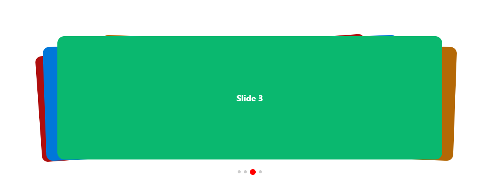
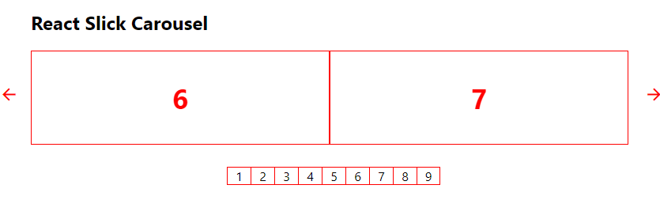

# Project Title

This repo is the part of my frot-end development journey. In modern web app we can see there are using so many image/video carousel. So i practice carousel slide using slick carousel and swiper slider. Swiper the most modern mobile touch slider which is really awesome and slick is also powerfull.

## Demo

https://react-carousel-xi.vercel.app/

## Lessons Learned

-   slick slider initialization

-   slick slider pagination customization

-   slick slider navigation customization

-   swiper slider initialization

-   swiper slider pagination customization

-   swiper slider navigation customization

-   swiper slider effect

## Screenshots

## Tech Stack

**Client:** HTML, CSS, Javascript, React, Next.js

## 🚀 About Me

I'm a front-end developer with backend knowledge.

## 🛠 Skills

**Front-end** : Javascript, React, Next.js HTML, CSS, Bootstrap, Tailwind, SASS, SVG, GSAP

**Aditional Backend** : Node.js, Express.js, MongoDB, MySQL

## Acknowledgements

-   [Swiperjs with React | Modern Touch Slider](https://www.youtube.com/watch?v=GmUo4PqXKzk&t)

-   [2020 Tutorial for Official SwiperJs React Version ](https://www.youtube.com/watch?v=l4kFO6VQPfA)
